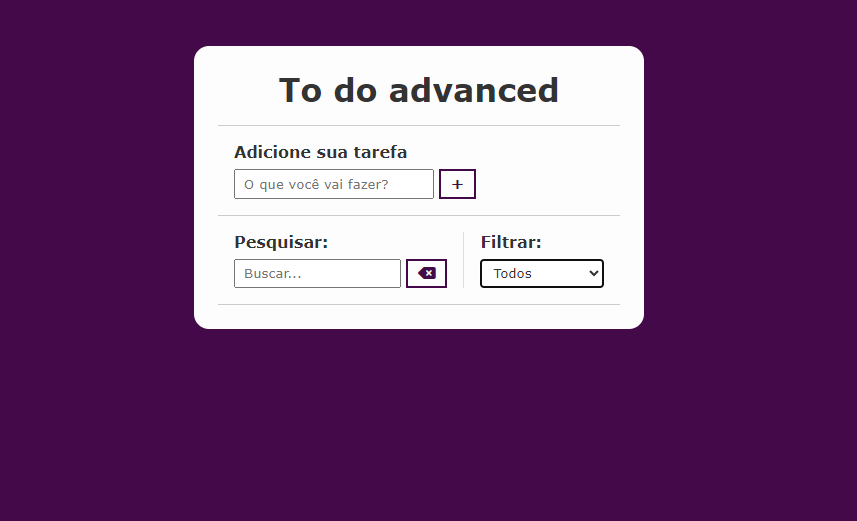

# Projeto To do List 📄
Esse projeto é uma lista simples de tarefas, usando HTML, CSS e JavaScript.
## 📋 Sobre projeto To do List
O projeto projeto To do List foi realizado composto pela seguinte matéria:
### Programação web I
Criamos um web site de uma lista de tarefas, usamos o aplicativo Visual Studio Code.
##  Descrição do projeto
Esse projeto foi pensado para criação de lista de tarefas, para ajudar os estudantes, melhorando sua organização e desempenho. Tudo foi pensado para o estudante conseguir usar com facilidade.
## Imagem do site:

## 🛠️ Tecnologias  
* HTML
* CSS
* JavaScript

### 🔧 Ferramentas
* VSCODE
* GitHub
### Sites Utilizados
* [Laço](https://developer.mozilla.org/pt-BR/docs/Web/JavaScript/Guide/Loops_and_iteration)

### Autores 
 [ Ana Laura](https://github.com/anacenali) 

 